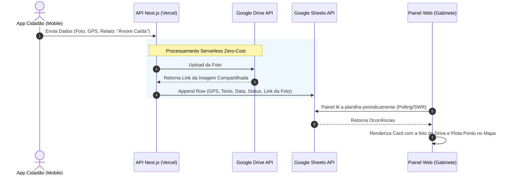
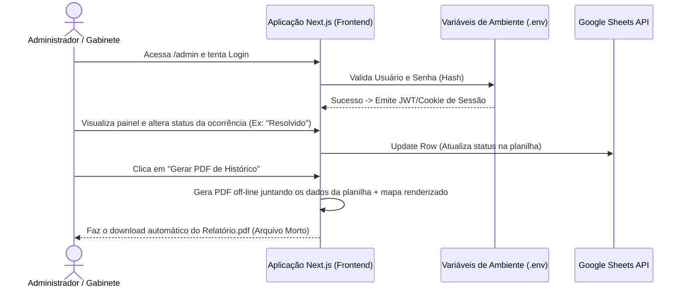

# DOSSIÊ TÉCNICO: ARQUITETURA E FLUXOS (SISTEMA MUNICIPAL INTEGRADO DE INTELIGÊNCIA CLIMÁTICA - SMIIC)
**Município de Cachoeiras de Macacu - Preparações, Desastres e Gestão Preventiva**

Este documento detalha a arquitetura tecnológica atualizada do Sistema Municipal Integrado de Inteligência Climática (SMIIC). O projeto passou por uma modernização arquitetural focada em **redução de custos (Zero-Cost)**, descentralizando serviços e eliminando a dependência de bancos de dados relacionais pagos ou com limitações rigorosas (ex: Supabase Free Tier) para o armazenamento de ocorrências e logs.

---

## 1. CONTEXTO E OBJETIVO PRINCIPAL
O SMIIC foi desenvolvido para resolver a fragmentação de informações (ex: grupos de WhatsApp caóticos) durante crises climáticas. Ele centraliza dados de telemetria, ocorrências e forças de trabalho municipais em um único painel e mapa interativo (War Room), atendendo a dois grandes pólos:
- **Prevenção:** Monitoramento antecipado de chuvas, cheias de rios e risco de incêndio florestal.
- **Resposta:** Triagem, geolocalização e despacho de chamados (ocorrências) reportadas via aplicativo para as secretarias competentes.

## 2. STACK TECNOLÓGICO OTIMIZADO (ZERO-COST ARCHITECTURE)
A nova arquitetura baseia-se em um modelo **Serverless/Frontend-First**, priorizando altíssima escalabilidade e uso de cotas gratuitas do ecossistema Google Workspace e Vercel:

- **Frontend (Painéis e Mapas):** Construído em React 18 / Next.js e hospedado na **Vercel**. Usa Tailwind CSS para UI responsiva. O mapa interativo é renderizado via Leaflet (`react-leaflet`) lendo arquivos GeoJSON estáticos (para bairros, UCs, etc).
- **Backend de Ocorrências (Google Sheets + Drive):** Em vez de usar um PostgreSQL, as ocorrências (textos, locais, categorias) enviadas pelo Aplicativo Cidadão são registradas como linhas em uma planilha do **Google Sheets** (Google Sheets API). As fotos anexadas são enviadas para pastas organizadas no **Google Drive** (Google Drive API), consumindo o limite generoso de 15GB por conta.
- **Backend Climático (Supabase Exclusivo):** O banco Supabase foi "enxugado" e agora é dedicado *exclusivamente* à recepção em tempo real de dados das estações climáticas e ao armazenamento dos cálculos pesados do Índice IRIF (Risco de Incêndio).
- **Autenticação Administrativa (Serverless Auth):** O login de gestores e secretarias não exige mais tabelas no banco. As credenciais administrativas são mantidas em Variáveis de Ambiente e gerenciadas via NextAuth/Sessões JWT locais.

## 3. O ROTEAMENTO INTELIGENTE E GESTÃO DE HISTÓRICO
O acesso à plataforma é unificado (`/`), mas a visualização e gestão são modulares:
- **Cidadão (App Mobile):** A população usará o App para fotografar e enviar o GPS da ocorrência. O app se comunica com a API do Next.js.
- **Administrador (Painel Web):** Os gestores da prefeitura acessam o painel, que lê o Google Sheets em tempo real para desenhar os Cards de Ocorrência na tela e plotar no mapa.
- **Gestão de Histórico (Exportação PDF):** Como o banco de dados não guarda mais o histórico de ocorrências antigas, o próprio Frontend possui um gerador de PDF (via `html2pdf` ou `jspdf`) que permite aos administradores salvar o estado atual do mapa e a lista de despachos para arquivo morto off-line.

## 4. MATRIZ DE VULNERABILIDADE E NÍVEIS OPERACIONAIS (MMVC)
O município é governado por um estado de alerta sistêmico ditado pela MMVC, alterado pelo Gabinete:
- **Nível 0:** Vigilância (Normal)
- **Nível 1:** Atenção
- **Nível 2:** Alerta
- **Nível 3:** Alerta Máximo
- **Nível 4:** Emergência (Desastre)

## 5. INTEGRAÇÃO "EXACLIMA" E O ÍNDICE IRIF (Risco de Incêndio)
- **Fórmula IRIF:** Pondera fatores climáticos dinâmicos e estáticos.
- **Integração Técnica:** Uma Edge Function/Rota de API, rodando em cron (09h, 12h, 15h, 18h), consome os dados da API Exaclima. A função insere os dados nas tabelas remanescentes do PostgreSQL (Supabase) e calcula a pontuação N1-N5.

---

## 6. DIAGRAMAS DE FLUXO DA NOVA ARQUITETURA

### 6.1. Fluxo de Ocorrências (Cidadão -> Prefeitura)

### 6.2. Fluxo de Autenticação e Exportação de Histórico

