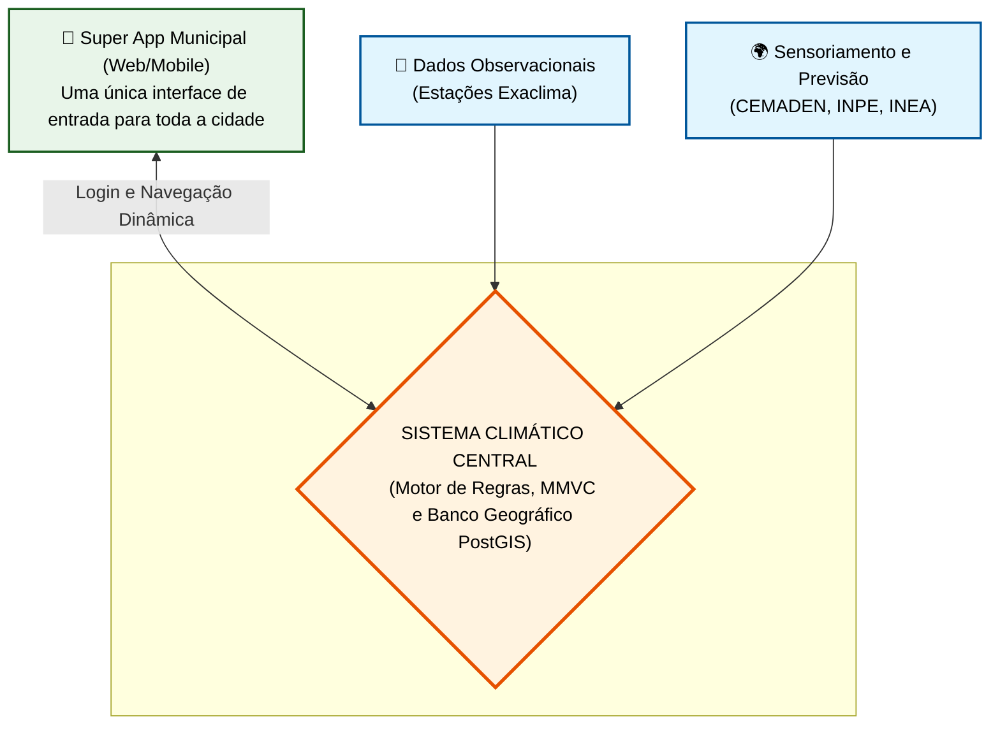
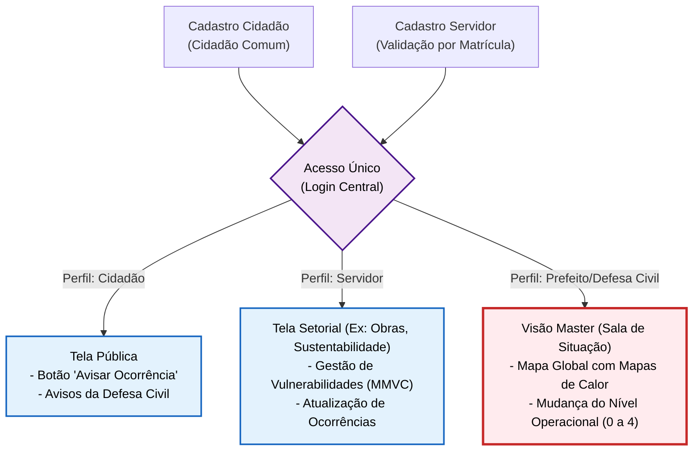
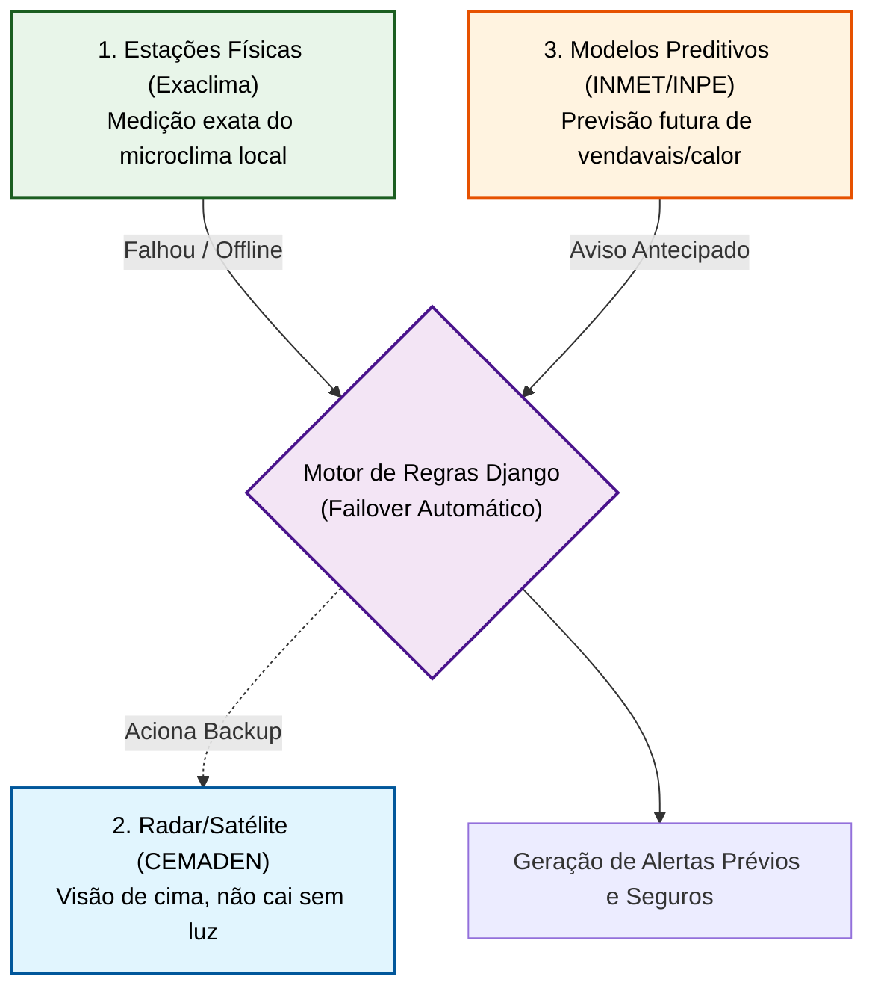
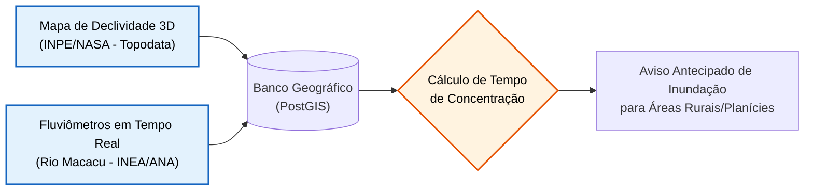
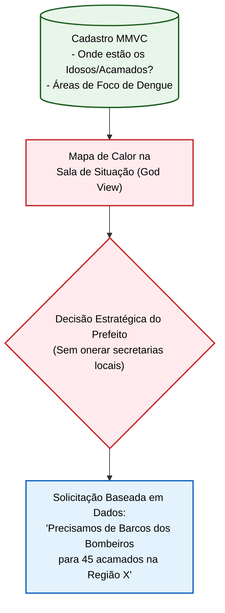
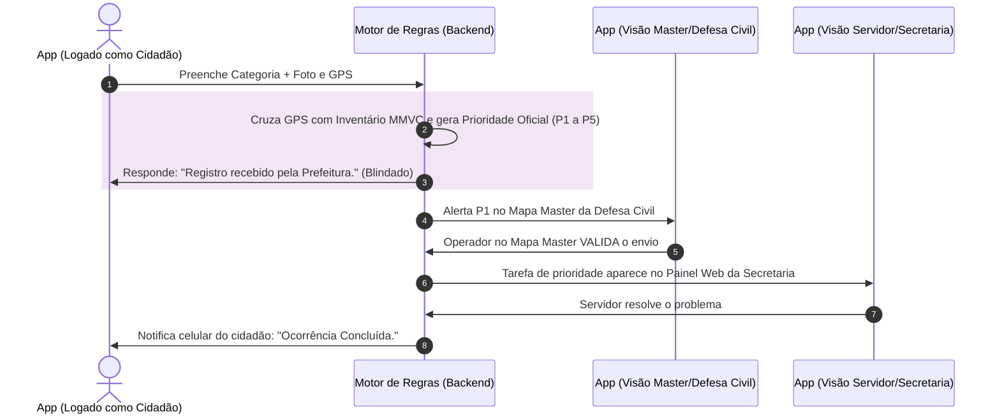
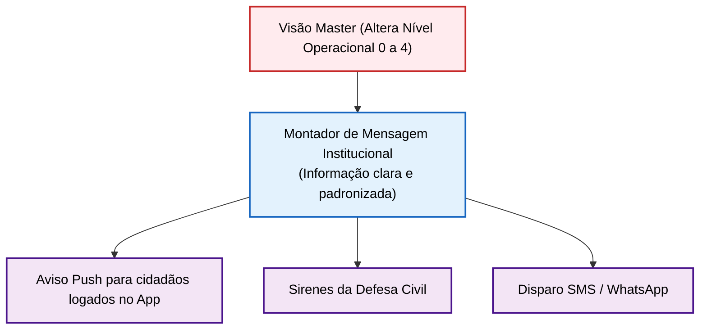
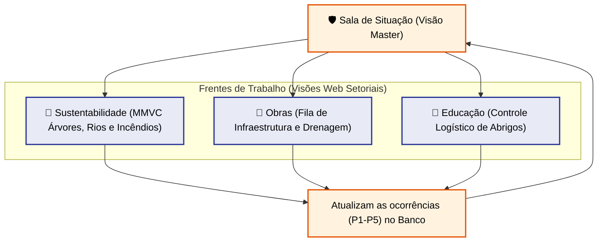
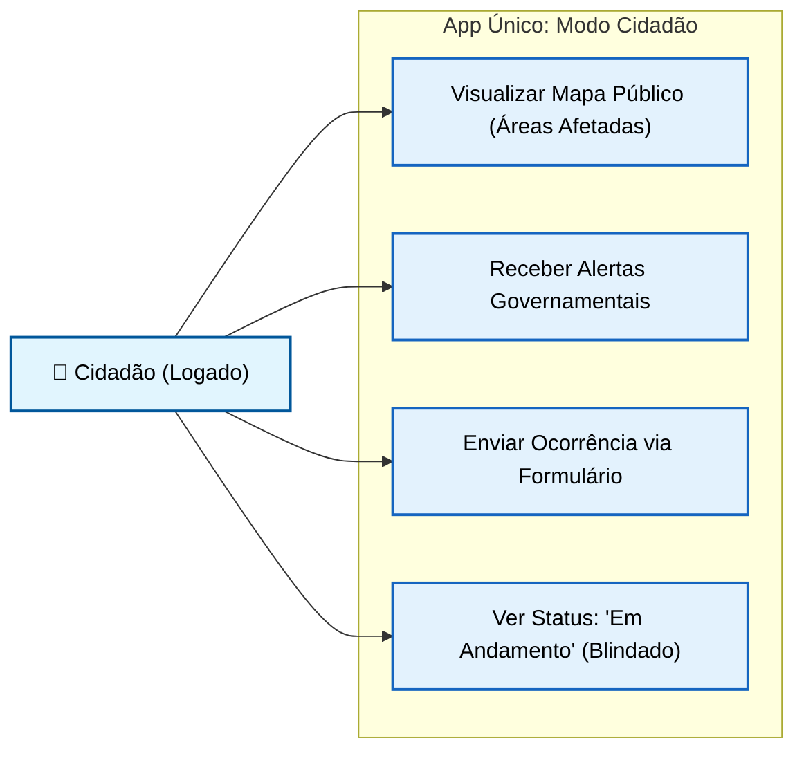
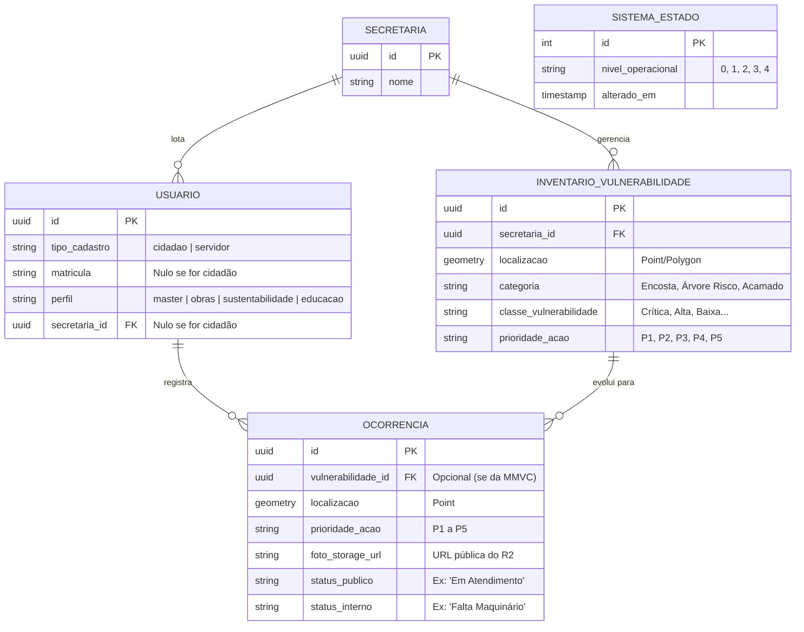

# DOSSIÊ TÉCNICO: ARQUITETURA E FLUXOS (SISTEMA DE INTELIGÊNCIA CLIMÁTICA)
**Município de Cachoeiras de Macacu - Preparação El Niño e Gestão Preventiva**

Este documento detalha a arquitetura tecnológica do Sistema Municipal Integrado de Inteligência Climática, projetado para operar com baixo custo de infraestrutura, alta tolerância a falhas e total adequação à realidade operacional das Secretarias Municipais.

---

## PÁGINA 1: CONTEXTO GERAL E BLINDAGEM
Toda a cidade (do Prefeito ao Cidadão) utiliza a **mesma plataforma**. O que muda é o nível de acesso. O núcleo opera via Motor de Regras e Matriz de Vulnerabilidade (MMVC), garantindo a blindagem operacional das secretarias e gestão baseada em dados reais.



---

## PÁGINA 2: O ROTEAMENTO DE TELAS (ACESSO ÚNICO)
Nós temos 1 só aplicativo. Quando o usuário faz login, a API verifica sua identidade e molda a interface. Servidores usam Matrícula; cidadãos usam cadastro comum (gov.br ou e-mail).



---

## PÁGINA 3: A TRÍADE CLIMÁTICA (TOLERÂNCIA A FALHAS DE SENSORES)
O sistema não depende apenas das 14 estações físicas locais. Para evitar um "apagão de dados" caso as estações fiquem sem energia ou internet durante o desastre, o Motor de Regras utiliza três camadas de dados redundantes.



---

## PÁGINA 4: TOPOGRAFIA E INUNDAÇÕES (CÁLCULO DE CABECEIRA)
Cachoeiras de Macacu sofre com alagamentos nas planícies e lavouras causados por chuvas nas cabeceiras (Serra). O sistema cruza dados estáticos de declividade com telemetria de rios para avisar produtores rurais *antes* da água chegar.



---

## PÁGINA 5: INTELIGÊNCIA PASSIVA E MAPAS DE CALOR (O REALISMO OPERACIONAL)
Entendendo os limites operacionais da Prefeitura (falta de viaturas na Saúde/Defesa Animal), o sistema cadastra dados sensíveis (Idosos Acamados, Animais) não para obrigar resgates utópicos, mas como **Inteligência Passiva (Business Intelligence)** para o Prefeito solicitar ajuda Estadual ou Federal com embasamento estatístico.



---

## PÁGINA 6: FLUXO DE VULNERABILIDADES E OCORRÊNCIAS
A visão do Cidadão é blindada. Ele usa um formulário guiado, o sistema cruza com a Matriz de Vulnerabilidade (MMVC), gera a Prioridade Oficial (P1 a P5) e despacha.



---

## PÁGINA 7: FLUXO DE EMISSÃO DE ALERTAS MULTICANAL
O Prefeito ou a Defesa Civil alteram o Nível Operacional (0 a 4) e disparam uma única mensagem estruturada para todos os canais integrados.



---

## PÁGINA 8: ARTICULAÇÃO ENTRE SECRETARIAS
Embora usem o mesmo banco, cada secretaria possui um layout focado em sua missão. Sustentabilidade e Obras operam a base de prevenção (MMVC).



---

## PÁGINA 9: O "WAZE CLIMÁTICO" (VISÃO DO CIDADÃO NO APP)
A interface simplificada e direta para a população relatar e acompanhar.



---

## PÁGINA 10: DIAGRAMA DE ENTIDADES (ALINHADO ÀS LEIS MUNICIPAIS)
O banco de dados atende integralmente aos Capítulos 5 e 6 do Protocolo de Gestão Preventiva. Foram incluídos a `INVENTARIO_VULNERABILIDADE`, as Prioridades (`P1` a `P5`) e o `Nível Operacional`.



---

## PÁGINA 11: INFRAESTRUTURA DE DADOS DE BAIXO CUSTO (ZERO GOOGLE/MICROSOFT)
Adequando-se à limitação orçamentária do município, a arquitetura utiliza soluções "Cloud Native" de altíssimo desempenho e custo praticamente zero para armazenamento, não dependendo de assinaturas do Google Workspace ou Office 365.

```mermaid
flowchart TD
    classDef front fill:#e1f5fe,stroke:#01579b,stroke-width:2px,color:#000000;
    classDef back fill:#e8f5e9,stroke:#1b5e20,stroke-width:2px,color:#000000;
    classDef db fill:#fff3e0,stroke:#e65100,stroke-width:2px,color:#000000;
    classDef cloud fill:#f3e5f5,stroke:#4a148c,stroke-width:2px,color:#000000;

    subgraph Aplicativos ["Interfaces de Usuário"]
        APP["📱 Mobile App\n(Lojas Oficiais)"]:::front
        WEB["💻 Painéis Web Setoriais\n(Hospedagem em Borda / Vercel)"]:::front
    end

    subgraph Servidor Central ["Motor do Sistema"]
        API["⚙️ Backend Python/Django\n(Servidor Linux Baixo Custo)"]:::back
        EXCEL["📊 Exportador Nativo Excel\n(Django gera planilhas\nsob demanda para Secretários)"]:::back
        API --> EXCEL
    end

    subgraph Armazenamento ["Bancos de Dados"]
        SQL[("🐘 PostgreSQL/PostGIS\n(Textos e Mapas GPS)") ]:::db
        R2[("☁️ Cloudflare R2 Storage\n(Fotos pesadas do Cidadão.\n10GB grátis e ZERO taxa de download)") ]:::cloud
    end

    APP --> API
    WEB --> API
    
    API -- "Salva textos/coordenadas" --> SQL
    API -- "Salva mídias pesadas" --> R2
```

**Benefícios da Arquitetura Econômica:**
1. **Cloudflare R2 (S3) no lugar do Drive:** Armazenamento de classe empresarial idêntico à Amazon, mas gratuito até 10GB e sem custo por transferência de arquivos (egress fee). Mantém o banco relacional leve.
2. **Exportação Nativa no lugar do Sheets:** O próprio sistema tem um botão "Exportar" que baixa arquivos `.xlsx` oficiais para os secretários elaborarem relatórios de gestão, cortando totalmente a necessidade de licenças corporativas terceirizadas.
