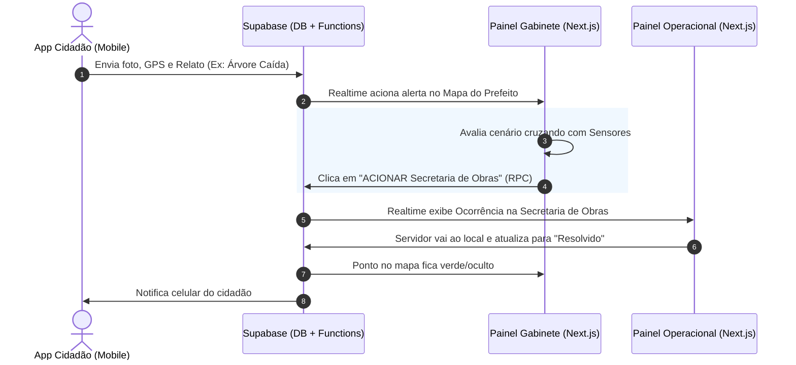

# DOSSIÊ TÉCNICO: ARQUITETURA E FLUXOS (SISTEMA MUNICIPAL INTEGRADO DE INTELIGÊNCIA CLIMÁTICA - SMIIC)
**Município de Cachoeiras de Macacu - Preparações, Desastres e Gestão Preventiva**

Este documento detalha a arquitetura tecnológica atualizada do Sistema Municipal Integrado de Inteligência Climática (SMIIC), projetado para operar como uma Sala de Situação centralizada e eficiente.

---

## 1. CONTEXTO E OBJETIVO PRINCIPAL
O SMIIC foi desenvolvido para resolver a fragmentação de informações (ex: grupos de WhatsApp caóticos) durante crises climáticas. Ele centraliza dados de telemetria, ocorrências e forças de trabalho municipais em um único painel e mapa interativo (War Room), atendendo a dois grandes pólos:
- **Prevenção:** Monitoramento antecipado de chuvas, cheias de rios e risco de incêndio florestal.
- **Resposta:** Triagem, geolocalização e despacho de chamados (ocorrências) para as secretarias competentes (Obras, Meio Ambiente, Defesa Civil, etc).

## 2. STACK TECNOLÓGICO ATUAL
A arquitetura baseia-se em um modelo Serverless/Frontend-First, priorizando altíssima escalabilidade e baixíssimo custo de infraestrutura (Zero Backend dedicado):

- **Frontend (Painéis e Mapas):** Construído em React 18 / Next.js e hospedado na **Vercel**. Usa Tailwind CSS para UI responsiva. O mapa interativo é renderizado via Leaflet (`react-leaflet`) lendo arquivos GeoJSON estáticos e conectando-se diretamente ao banco.
- **Backend / Plataforma de Dados:** Baseado integralmente no **Supabase** (PostgreSQL Gerenciado + Auth + Storage + Edge Functions). Não há servidor Python/Django na arquitetura.
- **Camada Lógica e Integrações:** 
  - Regras de negócio, cálculos (como o IRIF) e comunicação com a API Exaclima, CEMADEN e ANA são executados em **Edge Functions** (Supabase) ou rotas de API serverless do próprio Next.js.
  - Sincronização agendada via Webhooks/Cron jobs acionando as Edge Functions.

## 3. O ROTEAMENTO INTELIGENTE DE INTERFACE
O acesso à plataforma é unificado (`/`), mas a renderização é controlada pelas Políticas de Acesso (RLS) e claims de usuário no JWT emitido pelo Supabase Auth:
- **Cidadão (Futuro App Mobile):** A interface web bloqueia cidadãos sem vínculo institucional. A população usará um App para enviar fotos e GPS da ocorrência.
- **Nível 1: Visão Gabinete (`/gabinete`):** Acesso restrito (Defesa Civil/Gabinete). A *God View*. Todos os marcadores, todas as estações, chamados abertos. Permissão exclusiva para o botão "ACIONAR" e para a alteração dos Níveis Operacionais da MMVC.
- **Nível 2: Visão Operacional (`/operacional`):** Acesso para Secretarias (Obras, Meio Ambiente). Enxergam apenas as ocorrências atribuídas à sua pasta e têm poder apenas de marcar o despacho como "Em atendimento" e "Concluído".

## 4. MATRIZ DE VULNERABILIDADE E NÍVEIS OPERACIONAIS (MMVC)
O município é governado por um estado de alerta sistêmico ditado pela MMVC, alterado pelo Gabinete (manual ou sugerido por cálculos):
- **Nível 0:** Vigilância (Normal)
- **Nível 1:** Atenção
- **Nível 2:** Alerta
- **Nível 3:** Alerta Máximo
- **Nível 4:** Emergência (Desastre)

## 5. INTEGRAÇÃO "EXACLIMA" E O ÍNDICE IRIF (Risco de Incêndio)
- **Fórmula IRIF:** Pondera fatores climáticos dinâmicos (Temperatura, Umidade, Vento) e estáticos (Declividade, Tipo de Vegetação).
- **Integração Técnica:** Uma **Edge Function** no Supabase, rodando em cron (09h, 12h, 15h, 18h), consome os dados da API Exaclima. A função insere os dados nas tabelas do PostgreSQL e calcula a pontuação N1-N5, alimentando o UI em tempo real através do Supabase Realtime.

## 6. DIAGRAMA DE FLUXO (Ocorrências e Despachos)

